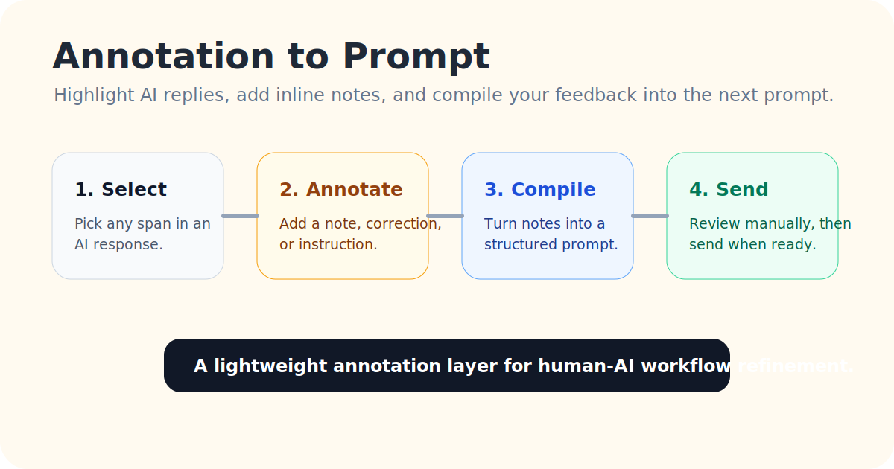
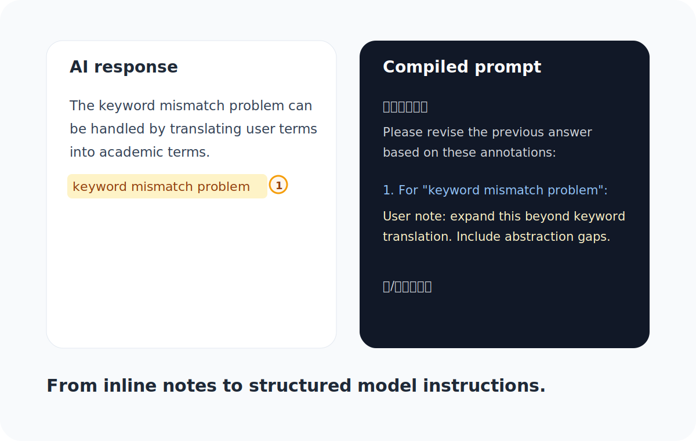

# Annotation to Prompt

Turn scattered feedback into structured prompts.

Annotation to Prompt 是一个面向 ChatGPT 网页版的浏览器批注扩展。它让你像改文档一样，在 AI 回复上直接划线、批注、编号，然后一键整理成下一轮可发送的 prompt。



它解决的是一个很常见但很少被认真处理的问题：

```text
AI 很会生成初稿；
人类很会判断哪里不对；
但人类很难低成本、结构化地把判断回流给 AI。
```

有了它，你不需要再手写一大段“针对第 1 点、第 2 点、第 3 点分别修改什么”。直接选中文段，写下批注，插件会帮你把这些零散判断整理成清晰的下一轮修改指令。

适合用来：

- 批改 ChatGPT 长回答，让它按你的标注重写。
- 校准 research memo、SOP、CV、工作方案、产品文档。
- 和 Agent 讨论复杂工作流时，逐段指出“不准确 / 需要展开 / 要删掉 / 要执行新任务”。
- 把人类判断力转成更稳定的 prompt，而不是每轮重新解释一遍。

## MVP 目标

第一版先跑通一个核心闭环：

```text
选中 assistant 回复片段
→ 添加批注
→ 原文高亮并展示序号和批注预览
→ 批注实时同步到输入框
→ 用户手动点击发送
```

它不自动发送、不读取无关页面、不上传数据、不改造 ChatGPT 本体。

## 为什么值得试

- **减少长文纠错负担**：不用再手动组织“针对 A/B/C 分别修改”的大段反馈。
- **保留上下文锚点**：每条批注都绑定到原文片段，减少模型误解。
- **让反馈可累计**：多条批注自动编号、汇总、重排。
- **保持用户控制权**：插件只整理 prompt，不自动发送。
- **本地优先**：第一版没有后端，批注保存在浏览器本地。

## 支持范围

- `https://chatgpt.com/*`
- `https://chat.openai.com/*`

## 使用方式

1. 打开 Chrome / Edge 的扩展管理页。
2. 开启「开发者模式」。
3. 选择「加载已解压的扩展程序」。
4. 选择本目录：`annotation-to-prompt`。
5. 打开 ChatGPT 网页版。
6. 选中一段 assistant 回复文本。
7. 点击浮动的「批注」按钮，或右键选择「添加批注」。
8. 在弹窗中输入批注，点击「暂存批注」或按 `Ctrl+Enter`。
9. 右下角会出现批注控制条，可点击「同步到输入框」或「复制批注」。
10. 输入框会生成类似下面的批注汇总：

```text
【批注汇总】
请基于以下批注处理上一轮输出，保留未被批注部分的主体结构：

1. 针对「关键词不一致」：
用户批注：这个论断不全面，还需要考虑概念层级错配和现实问题到学术问题的抽象差异。
【/批注汇总】
```



如果你想把它发给朋友试用，可以直接让对方看：[TRIAL_GUIDE.md](TRIAL_GUIDE.md)。

## 当前边界

- 只支持用户主动选中文本后的批注。
- 只支持已生成完成的 assistant 回复。
- 批注暂存在浏览器本地 `chrome.storage.local`。
- 缓存按会话隔离：已保存对话使用 ChatGPT URL 中的 `/c/{conversationId}`；没有 conversation id 的新对话使用当前浏览器 tab 的临时缓存桶。
- 刷新页面后会恢复批注高亮、预览气泡和控制条，但不会自动写入输入框；需要用户点击「同步到输入框」或「复制批注」。
- 输入框同步使用受控块 `【批注汇总】...【/批注汇总】`，尽量不覆盖用户自己写的其他内容。
- 如果输入框同步失败，可以用右下角「复制批注」按钮复制后手动粘贴。
- 删除批注后，序号会动态重排，并同步更新输入框。

## 设计原则

- 不自动发送，让用户保留最终控制权。
- 不自动拦截对话流，降低对 ChatGPT 正常功能的影响。
- 不暴露批注数据到远端，第一版全部本地运行。
- 先做「原文批注 + Prompt 编译器」，不做复杂画布和长期记忆。

更完整的 MVP 边界和技术路线见：[docs/mvp-spec-v0.md](docs/mvp-spec-v0.md)。

如果你只是想安装试用，建议先看：[TRIAL_GUIDE.md](TRIAL_GUIDE.md)。

如果你想把它独立发布、做成可搜索的开源项目，见：[docs/distribution-plan.md](docs/distribution-plan.md)。

## 已知限制

- ChatGPT 页面 DOM 变化可能导致选择器失效，需要维护。
- 高亮定位第一版主要依赖选中文本，重复文本可能定位到第一个匹配位置。
- 批注预览气泡会优先放在回复右侧空白区域；空间不足时会半透明贴近标注处，仍可能和页面内容接近。
- 如果 ChatGPT 输入框结构变化，自动同步可能需要适配。

## 下一步 Roadmap

- 增加批注标签：不准确、展开、删除、保留、改口径、执行新任务、沉淀偏好。
- 优化重复文本定位：加入 prefix / suffix 锚点匹配。
- 增加批注导出：JSON / Markdown / Prompt only。
- 增加一键清空当前会话批注。
- 抽象适配层，支持 Claude、Gemini、Codex Web 等更多网页。
